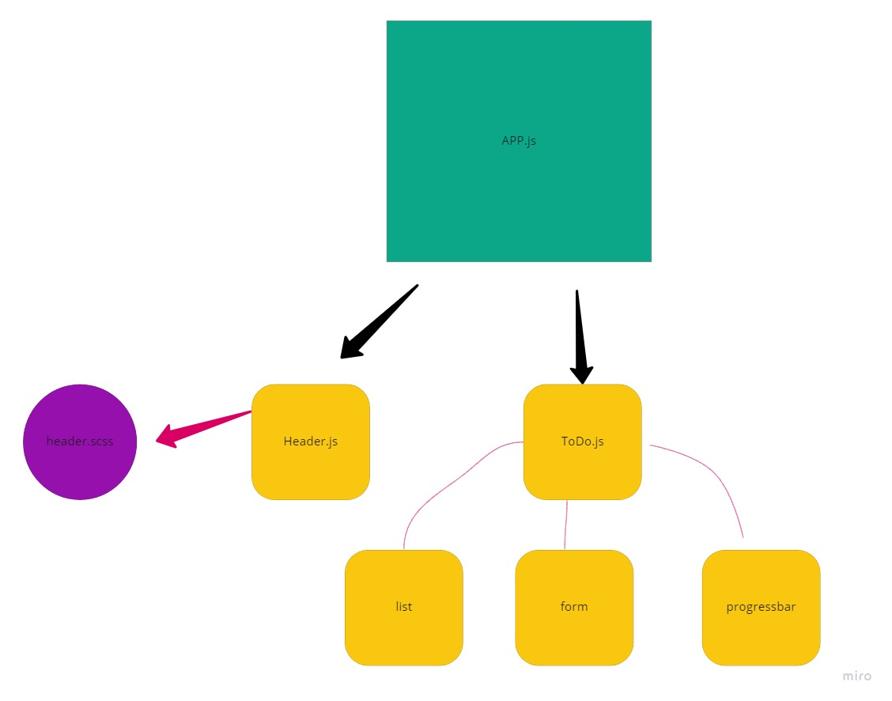

# ToDo

Todo is an application designed for creating and organising a “To Do” list in your browser.

## Author: Omar Ewies

* [Deployment](https://todo-oebitw.netlify.app/)

* [Pull Request](https://github.com/oebitw/todo/pulls?q=is%3Apr+is%3Aclosed)

## Run the app
* npm install
* npm start

## UML

